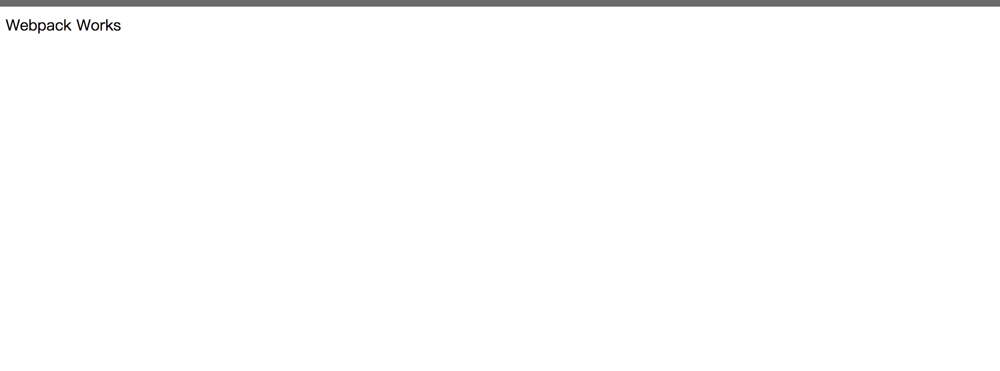

# webpack-react-redux
webpack-react-redux 
## 目录
-  init项目
## init 项目
`npm init` 按照提示填写项目信息
## 下载Webpack
1. `npm install --save webpack@3`
2.  配置webpack基础配置文件
webpack.dev.config.js

```js
const path = require('path');

module.exports = {
    entry: path.join(__dirname, 'src/index.js'),    
    output: {
        path: path.join(__dirname, './lib'),
        filename: 'bundle.js'
    }
};
```

3. 使用webpack编译文件
新建一个入口文件 `src/index`
为其添加一个简单的内容 
`document.getElementById('app').innerhtml = 'webpack works'`
执行命令 `webpack --config webpack.dev.config.js`

这时候就能看到生成了`lib`文件夹和`bubdle.js`

4. 在浏览器看下效果
在根目录下新建一个`template.html`文件
内容如下
```html
<html lang="en">
<head>
  <meta charset="UTF-8">
  <meta name="viewport" content="width=device-width, initial-scale=1.0">
  <meta http-equiv="X-UA-Compatible" content="ie=edge">
  <title>webpack-react-redux</title>
</head>
<body>
  <div id="app">
  </div>
  <script type="text/javascript" src="./lib/bundle.js" charset="utf-8" ></script>
</body>
</html>
```

在浏览器打开template.html，效果如下



